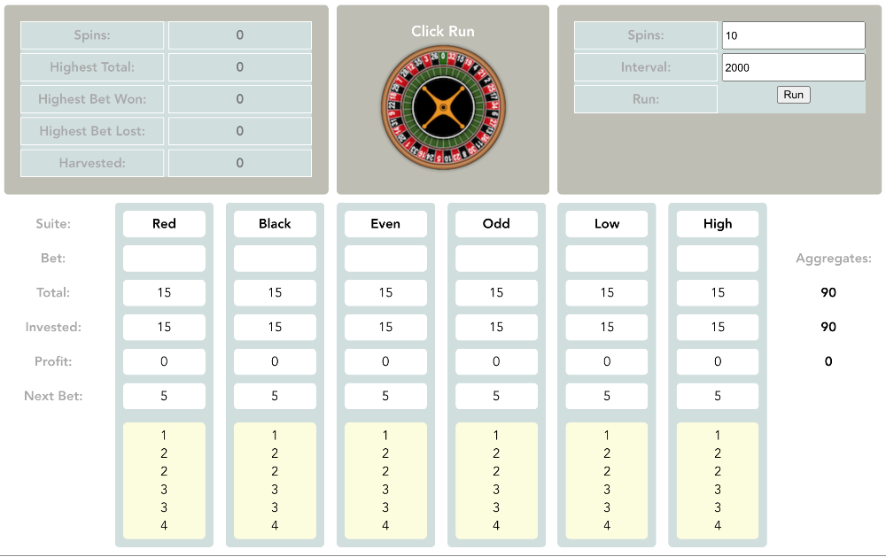

# Scarab

Configurable simulation of a progressive betting system for roulette, written in Vue.js.


## Overview

This application is designed to provide a configurable automated visualization of certain progressive betting strategies in the game of roulette. There are a number of well-known systems; this application illustrates a differential system in which the six even chance suites of numbers (red, black, even, odd, high, low) are played simultaneously, with the amount wagered on each determined by the results of the previous spin and the current "tally" for that suite.

The idea is to stay at the table long enough to hit a trend in one or more of the suites, so we want to be at a table with a low minimum bet, say $5 (the default setting).



Each suite starts its tally with a fresh "stack" of betting amounts, by default [1, 2, 2, 3, 3, 4] - the first and last numbers combine to determine the next bet to be placed. Upon a winning spin, that number is added to the end of the tally, and for a loss, those first and last numbers in the tally are removed. When a tally is empty or there is not enough left for the minimum bet, it is refreshed with a new stack. The game keeps track of the amount invested in each suite, and also provides aggregate statistics.

By default, the French La Partage rule is applied for zero, which returns to the player half of the bet, decreasing the house edge with a French wheel by half; these are the best odds to be found in roulette - this simulation does not include an option for playing with the American style wheel (which adds a double-zero) because the odds are stacked too heavily against the player.

Configuration also includes a threshold for "harvesting" a suite's winnings above a given amount, putting that sum aside and taking it out of play. You may also configure thresholds for stopping play upon hitting a maximum win or loss for any suite. Using these configuration variables allows modification and fine-tuning of the betting strategy, supporting flexible experimentation.


## Project setup

After downloading the repository, navigate to that directory and install dependencies.

```
npm install
```

### Compiles and hot-reloads for development
```
npm run serve
```

### Compiles and minifies for production
```
npm run build
```

### Lints and fixes files
```
npm run lint
```

### Customize configuration
See [Configuration Reference](https://cli.vuejs.org/config/).


## Usage

Configure the number of spins (default 10) and the interval between spins (expressed in milliseconds, default 2000). Click Run to start the simulation.

